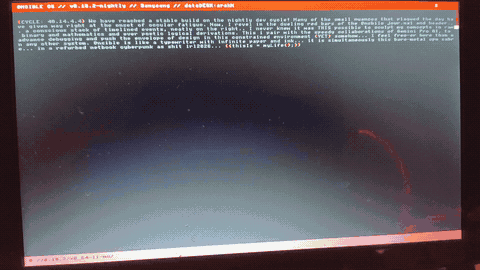

# ◬ @NSIBLE OS // v0.10.2-nightly // Banysang
> **by Ƨ Tech**
> *A Sovereign, High-Talon Semantic Logic Operating System.*

---

Designed strictly for the Acer Aspire One (x86, 32-bit framebuffer).

### ⌗ ARCHITECTURE (Banysang Cycle)
* **Kernel:** Zig *(No standard lib dependencies for graphics/input)*
* **Memory:** Dual-Lobe Static Allocation
  * **[ THE VOID ]** (42.13 MB): Persistent storage (History, Memos, System State).
  * **[ THE SAP ]** (88.00 MB): Volatile rendering buffer, wiped on every fetch.
* **Storage:** `aiua.tome` (Immortal Artifacts), `trail.tome` (Black Box)
* **Acoustics:** 8-bit PCM Math-Resonator (Pitch-shifted by `aiua.tome` mass)
* **Optic:** The Banyan Lens *(Multi-Spectral HTML Parser)*
* **Network:** Async Curl *(Shadow Flight)*
* **Input:** GZL Reflex + ANSI Motor
* **Palette:** Crimson, Silver, Brass, Black

---

### ⌗ CORTEX COMMANDS
| Input | Action |
| :--- | :--- |
| `@://url` | Fetch target (Hunt) |
| `zI` / `zO` | Scope In / Out (Raw -> Zen -> Matrix -> Root) |
| `memo [txt]`| Save text as an immortal local artifact |
| `shed` | Drop current tab / Clean the Sap memory |
| `cycle` | Return current cycle time state |
| `v` / `^` | Scroll up / down |
| `exit` | Matrix Clean & Terminate |

### ⌗ REFLEX SEQUENCES (GZL)
* `//-.` : Instant Memo (Triggered on strike)
* `.!XX-.` : Hardware Level Kill-Switch
* `.![-.` / `.!]-.` : Hardware Scope In / Out

---

### ⌗ BANYAN LENS MODES
1. **[RAW]**: Raw bytes. Brass delimiters.
2. **[ZEN]**: Pure Text. Structural masking.
3. **[MATRIX]**: Tags visible. Links Crimson.
4. **[ROOT]**: Scripts & Machine Logic visible (Brass).

---
**STATUS:** STAGING // **CODENAME:** BANYSANG (Ficus benghalensis sanguinem)
