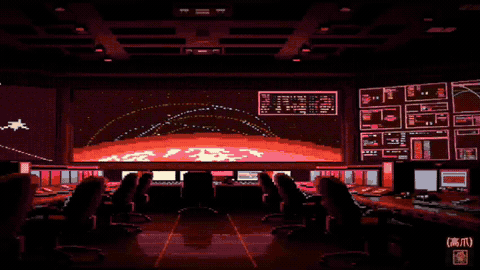
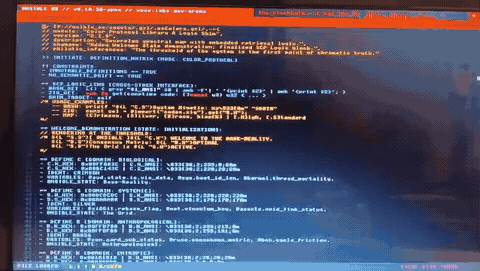

// [@://nsible_os/README.md/.-={
//   module: "Project Manifest",
//   version: "v0.11.14-apex // Banysang",
//   description: "The outer membrane of the sovereign system; defines purpose, architecture, and interaction protocols. It is false to assume the matrix is entirely sealed from the void.",
//   changes: "Phase 4.4 CODEP: Verity Refactor. Audited manifest logic and structural encapsulation.",
//   philotic_inferences: "A system that cannot describe itself to its operator is merely a tool; a system that defines its own existence is a sovereign entity."

# ◬ @NSIBLE OS // v0.11.14-apex // Banysang
> **by Ƨ Tech MMXXVI**
> *A Sovereign, Talon Alta Semantic Logic Operating System for 32-bit Xs.*

---

Designed for the Acer Aspire One (x86, 32-bit framebuffer); but intended to service 32-bit systems en masse.

### ⌗ ARCHITECTURE (Banysang Cycle)
* **Kernel:** Zig 0.15.2 *(No standard lib dependencies for graphics/input)*
* **Ignition:** Immersive ANSI TUI Bootloader *(Sudo Pre-Elevation, Dynamic GZL-X Versioning, 0.008φ Cycle Sync)*.
* **Memory:** Dual-Lobe Static Allocation
  * **[ THE VOID ]** (42.13 MB): Persistent storage (History, Memos, System State).
  * **[ THE SAP ]** (88.00 MB): Volatile rendering buffer, wiped on every fetch.
* **Storage:** `aiua.tome` (Immortal Artifacts), `trail.tome` (Black Box). 
* **Acoustics:** 8-bit PCM Math-Resonator & Native background djinn thread (32-band FFT telemetry).
* **Optic:** The Banyan Lens *(Multi-Spectral HTML Parser) + Satori Optics (Token Auto-Focuser)*.
* **Vinculum:** Shadow Flight via Port 4213.
* **Input:** GZL Reflex + ANSI Motor Cortex *(Multi-line traversal native)*.
* **Palette:** @NSIBLE-RED, Silver, Brass, Black.

---

### ⌗ CORTEX COMMANDS
| Input | Action |
| :--- | :--- |
| `aud/play` | Begin playback (`[x]/aud/play` for MELT queue interception) |
| `aud/add` | Append target to playlist without forcing play state |
| `aud/pause` \| `stop`| Pause or halt the background djinn |
| `aud/skip` \| `back` | Navigate timeline audio tracks |
| `aud/rmv` | Remove current track from `.queue.nsb` |
| `aud/shf` \| `rpt` | Toggle Shuffle / Repeat queue state |
| `aud/clear` | Purge queue and index memory |
| `aud/queue` | View active queue in Shell Output modal |
| `aud/vol/[int]`| Direct volume setting |
| `@://url` | Fetch target (Hunt) |
| `@://xn--tatic-rra.tech`| Pipe test entry target |
| `w3?. [query]`| Global Matrix Search via Ghost Cloak (WAF bypass) |
| `[x]` | MELT Traverse (Follow Link Index) |
| `[x] \| memo` | True Pipe: Asynchronous background extraction to local disk |
| `calc` | Invoke Native AST Recursive Descent Arithmetic Engine |
| `stargaze` | Entropic Wind: Random node shadow-flight (Bright/Dark Object) |
| `zI` / `zO` | Scope In / Out (Raw -> Zen -> Matrix -> Root) |
| `memo [txt]`| Save text as an immortal local artifact in `timeline/mems/` |
| `mount` | Mount dynamic external drives to `/media/static/` |
| `unmount` | Eject and unmount dynamic external drives |
| `shed` | Drop current tab / Clean the Sap memory |
| `radio` | Philotic Resonance Tuning Modal |
| `cycle` | Return current cycle state (Strict 0.0 precision) |
| `assist` / `?`| Project the Native Assist & Dev Tracker Overlay |
| `↓` / `↑` | Scroll active matrix down / up |
| `exit` | Matrix Clean & Terminate |

### ⌗ REFLEX SEQUENCES (GZL)
**System & Timeline Traps:**
* `//-.` : Instant Memo (Triggered on strike)
* `\| memo` : Pipeline extraction to GZL artifact
* `.!ED-.` : Open target in The Composer Lobe (Explicit Timeline Rail Push)
* `.!@&-.` : Force Cache Reload
* `.!FL-.` : Toggle Satori Optics (Crimson Scan Line / Arrow Focuser)
* `.!FS-.` : Satori Strike (Capture isolated Brass token to journal)
* `.!XX-.` : Hardware Level Kill-Switch / Discard (With Temporal Dirty Lock)
* `.![-.` / `.!]-.` : Hardware Scope In / Out
* `.!T<-.` / `.!T>-.` : Switch Timeline Tab (Triggers spatial buffer erasure)
* `.!R^-.` / `.!Rv-.` : Shift Node Position on Timeline Rail
* `.!C+-.` : Cycle Node Color Identity (Iterates through available palette)
* `.~[cc]-.` : Explicit Node Color Assignment (e.g., `.~CH-.` for Crimson High, `.~SS-.` for Silver Standard)
* `.!SR-.` : Toggle Sort Mode (Name ASC/DESC, Date ASC/DESC)
* `.!VD-.` : Void Banishment (Initiates Temporal Decay Verity Lock)
* `.!..-.` : Hardware Shutdown
* `.!./-.` : Hardware Reboot

**Composer IDE Modals:**
* `.!SV-.` : Commit Composer buffer to local disk
* `.!SK-.` : Seek Mode (Find target within buffer)
* `.!SW-.` : Switch Mode (Find & Replace target occurrences)
* `.!ST-.` : Save-To Mode (Define explicit GZL save path)
* `.!EX-.` : OS Command Matrix (Execute @:// without dropping buffer)

---

### ⌗ SOVEREIGN PROTOCOLS
1. **Tabula Rasa Stasis**: Upon first ignition, the system halts for Socius designation.
2. **Avium Resonance**: A unique 16-character cryptographic anchor forged from temporal variance.
3. **The Vinculum**: A secure network bridge for remote terminal injection.
4. **The Ghost Cloak**: Forged network signatures to bypass corporate WAFs and CAPTCHA walls.
5. **The Entropic Wind**: Algorithmic entropy via dual-flight logic to prevent localized data echo chambers.
6. **.exp Protocol**: Strict artifact extension swapping and matrix stashing to prevent double-dot anomalies.

---

### ⌗ BANYAN LENS MODES
1. **[RAW]**: Raw bytes. Brass delimiters.
2. **[ZEN]**: Pure Text. Structural masking.
3. **[MATRIX]**: Tags visible. Links @NSIBLE-RED.
4. **[ROOT]**: Scripts & Machine Logic visible (Brass).

---
**STATUS:** IMMUTABLE // STABLE TAG **CODENAME:** BANYSANG (Ficus benghalensis sanguinem)

// }-.]
